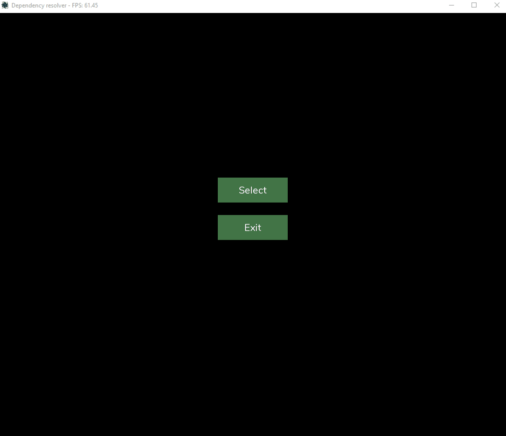

# Dependency resolver tool (DRT)

Dependency resolver tool is consisted of two main parts:
- **Dependency scanner** - scans all dependencies among your project files.
- **Graph visualizer** - draws graph on the screen.

Scanner is used to get all project files and includes which is then used to create a directed cyclic or acyclic graph. Cycle (if present) is removed by reversing certain edges and topological order is computed at the same time. Graph with altered state (in case of cycle presence) is passed to a node layering module that assigns nodes to different vertical layers and computes alternative traversal edges in case there are long edges by adding *dummy vertices*.  Finally, graph and layering is passed to graph visualizer where it is then rendered onto the screen.

The tool can be used to quickly find circular dependencies.

## Requirements

Requires: **Python 3.7+**

## How to run
#### Step 1
Open a terminal and navigate to where you extracted the DRT
Example: `cd "G:\dependency-resolver-master\"`
#### Step 2
Run `pip install -r requirements.txt`
#### Step 3
Run `py main.py`

## How to use

Click on the *Select* button to select a directory containing C/C++ project files. Dependency scanner will get all the includes from files and create a hierarchical representation of project dependencies. Warnings will show in bottom-left corner in case a cyclic dependency was detected. Besides, at least one of edges that is in the cycle will be highlighted.

## Background

DRT is a small proof-of-concept tool developed for a semester project to show how toposort algorithm could be practically used.

## Demo

